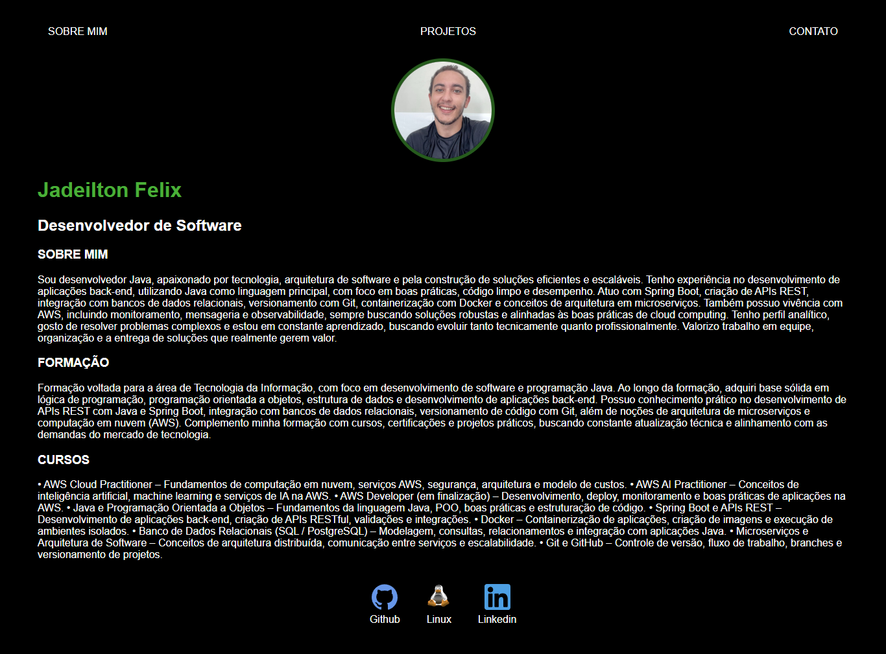

# 💼 Portfólio Pessoal – Jadeilton Felix

Este repositório contém meu **primeiro portfólio pessoal**, desenvolvido com **HTML5 e CSS3**, com foco em aprendizado, prática e apresentação profissional.

O projeto foi criado inicialmente como **teste e base de estudos**, servindo como ponto de partida para evoluções futuras no front-end.

---

## 🖥️ Visão Geral


  

O site apresenta um layout simples, moderno e com tema escuro, contendo:

- Seção **Sobre Mim**
- Informações de **Formação**
- Lista de **Cursos e Certificações**
- Área de **Projetos** (em evolução)
- Links para **GitHub** e **LinkedIn**

---

## 🚀 Tecnologias Utilizadas


- **HTML5** – Estrutura da aplicação  
- **CSS3** – Estilização e layout  
- **Google Fonts** – Tipografia  
- **Ícones** – GitHub, Linux e LinkedIn  

---

## 📁 Estrutura do Projeto

```bash
📦 portfolio
 ┣ 📜 index.html
 ┣ 📜 style.css
 ┗ 📂 assets
    ┗ 📂 images
